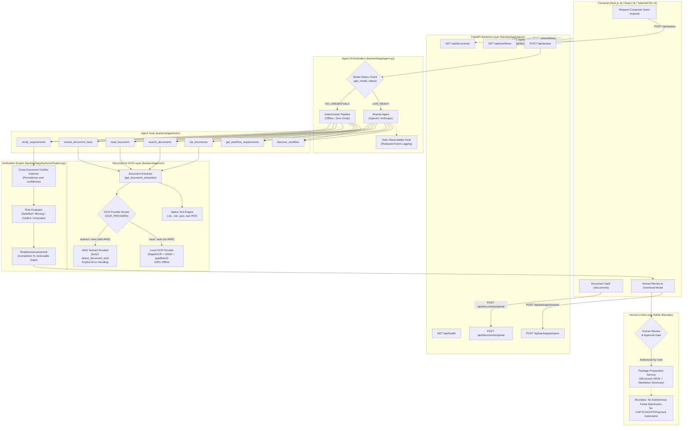

# Paperwork Agent

**An evidence-first administrative paperwork assistant that turns complex bureaucratic goals into verified, evidence-backed application packages while keeping humans strictly in control of consequential actions.**

Developed for the **AWS Agents for Humans Hackathon**, Paperwork Agent replaces tedious, error-prone manual administrative preparation with an intelligent, auditable pipeline. Rather than acting as a simple conversational wrapper or ungrounded document summarizer, Paperwork Agent orchestrates multi-step evidence discovery, routes image and PDF scans through optical character recognition (OCR), extracts factual claims with cryptographic and textual provenance, runs code-backed deterministic verification across multiple documents, flags factual conflicts, and prepares an authorized submission package.

---

## 1. Problem

Administrative and governmental applications (such as visas, passport renewals, licensing, and civil registrations) are notoriously fragmented:
- **Scattered Evidence**: Applicants must juggle government identity cards, utility bills, educational diplomas, employment letters, and certificates stored in various formats (plain text, PDFs, scanned images, and photos).
- **Complex Requirements**: Rules dictate acceptable document types, date freshness thresholds, and specific mandatory fields.
- **Silent Discrepancies**: Real-world paperwork frequently contains contradictory data (e.g., a transposed day of birth on an academic certificate versus a national ID). Traditional document summarizers frequently "smooth over" these discrepancies or hallucinate consistency.
- **Premature Submissions**: Applicants submit incomplete or conflicting packets, resulting in costly processing delays, rejection fees, or outright denial.

Ordinary conversational chatbots cannot solve this problem because they lack deterministic verification rules, cannot guarantee that extracted facts match original documents, and are prone to hallucinating compliance.

---

## 2. Solution

Paperwork Agent implements a structured, evidence-first workflow:

$$\text{Goal} \longrightarrow \text{Requirements} \longrightarrow \text{Evidence} \longrightarrow \text{Verification} \longrightarrow \text{Readiness} \longrightarrow \text{Human Review} \longrightarrow \text{Package}$$

1. **Understand Goal**: Interprets the user's natural language objective (e.g., *"I want to complete the example application"*).
2. **Discover Requirements**: Matches the goal against a registry of official workflow schemas to load mandatory and optional requirements, accepted evidence types, and validation hints.
3. **Acquire Evidence**: Discovers available documents, executes targeted semantic and keyword searches, and transparently routes scanned PDFs or image uploads through local or cloud OCR.
4. **Extract Structured Facts**: Pulls discrete fields (e.g., `full_name`, `date_of_birth`, `address`) accompanied by source document IDs, page numbers, and verbatim evidence snippets.
5. **Authoritative Verification**: Runs deterministic verification logic to classify every requirement as **Satisfied**, **Missing**, **Conflict**, or **Uncertain**.
6. **Flag Conflicts First**: If two independent documents disagree on a consequential fact, the discrepancy is surfaced as a first-class conflict requiring human resolution.
7. **Human-in-the-Loop Approval**: Presents an actionable readiness assessment. The human user reviews all evidence and authorizes the preparation of a structured, downloadable application bundle.

---

## 3. Why This Is an Agent

In the context of the **AWS Agents for Humans Hackathon**, Paperwork Agent demonstrates the power of true agentic system design over simple prompt-and-response LLM wrappers:

- **Autonomous Tool Selection**: The agent evaluates the user's goal, determines what evidence is lacking, and chooses which tools to invoke across multiple iterative steps.
- **Dynamic Evidence Gathering**: Rather than dumping entire document folders into an LLM context window, the agent queries directory listings, executes targeted searches, inspects relevant files, and extracts structured facts on demand.
- **Strict Separation of Concerns**:
  - **LLM / Agent Responsibilities**: Interpreting unstructured user goals, reasoning about document relevance, selecting tools, and formulating actionable advice.
  - **Deterministic Code Responsibilities**: Document text indexing, OCR engine execution, rule-based requirement checking, cross-document conflict detection, completion percentage calculation, and packaging.
- **Safety Boundaries**: The agent cannot invent facts, override verification rules, or perform external consequential submissions without human authorization.

The agent is built on top of the **Strands Agents SDK**.

---

## 4. Architecture

### System Flowchart



### Architectural Highlights
- **Client**: Next.js 16 with React 19 and TailwindCSS v4 delivering a dark-mode, responsive administrative interface.
- **API**: FastAPI server handling request validation, CORS, safe document uploads, and package preparation.
- **Agent**: Strands Agents SDK coordinating the 7 core tools with safe event-driven observability.
- **OCR Engine**: Decoupled provider layer supporting 100% offline RapidOCR with fallback/optional AWS Textract.
- **Deterministic Rules Engine**: Pydantic-validated verification logic calculating readiness and highlighting discrepancies.

---

## 5. Strands Agents SDK

The agent is instantiated using the **Strands Agents SDK** (`strands-agents`):

```python
from strands import Agent
from app.prompts import SYSTEM_PROMPT
from app.agent import ALL_TOOLS, _create_model, SafeAgentObservabilityHook

agent = Agent(
    model=_create_model(),
    system_prompt=SYSTEM_PROMPT,
    tools=ALL_TOOLS,
    structured_output_model=ReadinessAssessment,
    hooks=[SafeAgentObservabilityHook()],
)
```

### Key SDK Capabilities Utilized:
- **Tool Registration**: All 7 tools are decorated with `@tool`, exposing strict typing, JSON docstrings, and schemas to the LLM.
- **Structured Output**: Employs `structured_output_model=ReadinessAssessment` to guarantee that agent executions produce validated Pydantic models.
- **Safe Observability**: Attaches a custom `SafeAgentObservabilityHook` that subscribes to SDK events (`BeforeInvocationEvent`, `AfterInvocationEvent`, `BeforeToolCallEvent`, `AfterToolCallEvent`). It records execution timing and tool names while **strictly redacting** user prompts, file content, extracted values, PII, and API keys.
- **Deterministic Fallback**: If no LLM credentials are configured (`ModelStatus.NO_CREDENTIALS`), the backend routes to `assess_paperwork_deterministic`, executing the exact same 7 tools without fabricating LLM calls.

> **Note on Bedrock AgentCore**: Amazon Bedrock AgentCore is not required for the current implementation and is not currently used.

---

## 6. Tool Architecture

The agent interacts with paperwork and workflows through 7 purpose-built tools located in `backend/app/tools/`:

| Tool Name | File | Purpose | Inputs | Outputs / Effects | Classification |
| :--- | :--- | :--- | :--- | :--- | :--- |
| `discover_workflow` | `requirements.py` | Matches a user goal against registered workflow definitions. | `user_goal: str` | Matched `workflow_id`, `confidence`, and matching explanation. | Workflow Reasoning |
| `get_workflow_requirements` | `requirements.py` | Loads required and optional requirements, accepted evidence types, and hints. | `workflow_id: str` | Complete requirement schema and validation rules. | Workflow Reasoning |
| `list_documents` | `documents.py` | Discovers available files in the user document store. | None | Document IDs, filenames, sizes, formats, extraction methods. | Evidence Discovery |
| `search_documents` | `documents.py` | Executes targeted keyword search over document text and OCR output. | `query: str` | Top-matching document IDs, snippets, and relevance scores. | Evidence Discovery |
| `read_document` | `documents.py` | Retrieves full normalized document text and provenance metadata. | `document_id: str` | Content, line count, extraction method, confidence. | Evidence Acquisition |
| `extract_document_facts` | `documents.py` | Extracts requested factual fields with verbatim supporting snippets. | `document_id: str`, `requested_fields: str` | List of `DocumentFact` items with provenance and confidence. | Fact Extraction |
| `verify_requirements` | `verification.py` | Deterministically validates facts against requirements and detects conflicts. | `workflow_id: str`, `evidence_json: str` | Validated `ReadinessAssessment` with completion % and conflicts. | Authoritative Verification |

---

## 7. OCR Pipeline

Scanned paperwork, photocopies of certificates, and photographs of identity cards are first-class evidence sources.

```
                         [Incoming Document / Upload]
                                      │
            ┌─────────────────────────┴─────────────────────────┐
            │                                                   │
    [Image (.png/.jpg) or                           [Machine-Readable]
     scanned PDF (< 50 chars/pg)]                  [.txt, .md, .json, text PDF]
            │                                                   │
            ▼                                                   ▼
     [OCR Factory]                                     [Native Extractor]
     ├── provider="local"    ──> RapidOCR (offline)             │
     ├── provider="textract" ──> AWS Boto3                      │
     └── provider="auto"     ──> Textract if AWS creds,         │
                                 else Local OCR                 │
            │                                                   │
            └─────────────────────────┬─────────────────────────┘
                                      │
                                      ▼
                        [Document Extraction Model]
                        ├── text: str (normalized lines)
                        ├── extraction_method: "local_ocr" | "textract" | "native_text"
                        └── confidence: float (0.0–1.0) or "high"
```

### Core Implementation Principles:
1. **Genuinely Local Default**: `LocalOCRProvider` uses `rapidocr-onnxruntime` and `pypdfium2` (for PDF rendering). It executes 100% offline with zero outbound network calls, upholding local privacy.
2. **Explicit Textract Failures**: `TextractOCRProvider` interfaces with AWS Textract using `boto3`. If credentials, region, or permissions fail, it raises an explicit `OCRProviderError` instead of silently returning empty evidence.
3. **Reading-Order Line Grouping**: RapidOCR box coordinates are grouped into horizontal lines based on vertical centroid clustering, ensuring multi-word lines (e.g. `Name: Demo Applicant`) are preserved.
4. **Confidence Safety Rule**:
   $$\text{High OCR Confidence} \neq \text{Factual Correctness}$$
   If an OCR scan reports a Date of Birth with 99% character recognition confidence, but another document lists a different date, the verification engine **flags a conflict**. High OCR confidence measures character clarity; it does not override cross-document verification.
5. **Synthetic Demo Asset**: Includes a minimal synthetic scan at [`backend/data/sample_documents/identity_scan.png`](file:///d:/Projects/Paperwork%20AI/backend/data/sample_documents/identity_scan.png) containing non-PII fields (`Name: Demo Applicant`, `Date of Birth: 15/03/1995`, `Address: 123 Example Road`).

> **Textract Live Validation Status**: `NOT RUN — NO AWS CREDENTIALS` (AWS credentials are not configured in the development environment; provider parsing, normalization, and failure handling are verified via mock unit tests).

---

## 8. Evidence and Verification Model

To prevent hallucinations, verification is handled deterministically:

### Conflict Detection in Action
Given the following user documents:
- **Identity Document** (`identity.txt`): `date_of_birth: 1995-03-15`
- **Degree Certificate** (`certificate.txt`): `date_of_birth: 1995-03-16`

The deterministic engine compares the normalized dates across sources. Rather than selecting one or guessing, it flags an authoritative conflict:
```text
[CONFLICT] Identity Proof
  Field 'date_of_birth' values mismatch:
    - 1995-03-15 (Source: identity.txt)
    - 1995-03-16 (Source: certificate.txt)

[CONFLICT] Date of Birth Verification
  Field 'date_of_birth' values mismatch:
    - 1995-03-15 (Source: identity.txt)
    - 1995-03-16 (Source: certificate.txt)
```

### Readiness Assessment Properties:
- `ready`: Boolean flag (`False` if any mandatory requirement is missing or in conflict).
- `completion_percentage`: Calculated as $\frac{\text{Satisfied Required Checklist Items}}{\text{Total Required Items}} \times 100$.
- `satisfied_requirements`: Satisfied items with supporting evidence snippets and confidence.
- `missing_requirements`: Unsatisfied items with human-readable hints and accepted document types.
- `conflicts`: Field-level discrepancies across documents.
- `recommended_next_actions`: Concrete steps the user should take to resolve gaps.

---

## 9. Human-in-the-Loop Safety

Paperwork Agent maintains a strict safety boundary:

- **Work Product Authorization**: Human approval authorizes the preparation and export of the application readiness package (`pkg-*`).
- **No Consequential Actions**: The system **never** autonomously submits forms to external government portals, engages with banking or payment gateways, enters one-time passwords (OTPs), or solves CAPTCHAs.
- **Auditable Provenance**: Every extracted fact links directly back to its source file, page number, and original text snippet.

---

## 10. Privacy & Data Handling

- **Local Document Storage**: Uploaded files and demonstration documents are stored locally in `backend/data/documents/`.
- **Synthetic Data**: All documents shipped in this repository use synthetic sample data.
- **No Cloud Upload by Default**: Documents are processed locally on your machine unless AWS Textract or external LLMs are explicitly enabled.

> [!WARNING]
> **Privacy Notice**: Do not upload real passports, government identity cards, financial statements, or sensitive personal documents to this public hackathon demonstration repository.

---

## 11. Project Structure

```text
paperwork-agent/
├── backend/
│   ├── app/
│   │   ├── __init__.py
│   │   ├── agent.py               # Strands Agent setup, model routing, and observability
│   │   ├── api.py                 # FastAPI REST API (upload, assess, package endpoints)
│   │   ├── prompts.py             # System prompt and core behavioral guidelines
│   │   ├── schemas.py             # Pydantic models (ReadinessAssessment, DocumentFact, etc.)
│   │   ├── ocr/                   # Optical Character Recognition provider subsystem
│   │   │   ├── __init__.py        # Exports extract_document_ocr, providers, exceptions
│   │   │   ├── base.py            # OCRProvider base class and data models (OCRResult)
│   │   │   ├── factory.py         # Provider resolver, AWS credentials inspector, caching
│   │   │   ├── local.py           # RapidOCR ONNX provider + pypdfium2 PDF rasterizer
│   │   │   └── textract.py        # AWS Textract provider using boto3
│   │   └── tools/                 # Registered agent tools
│   │       ├── __init__.py
│   │       ├── documents.py       # list, search, read, and fact extraction tools
│   │       ├── requirements.py    # discover_workflow and get_workflow_requirements
│   │       └── verification.py    # Authoritative deterministic verification & conflict rules
│   ├── data/
│   │   ├── documents/             # Active document store (txt, md, json, pdf, png, jpg)
│   │   ├── sample_documents/      # Minimal synthetic demo assets (identity_scan.png)
│   │   └── workflows/             # Registered workflow definitions (example_application.json)
│   ├── scripts/
│   │   └── make_demo_image.py     # Script to generate minimal synthetic demo scan
│   ├── tests/
│   │   ├── __init__.py
│   │   ├── conftest.py            # Pytest configuration and sys.path fixtures
│   │   ├── test_agent.py          # Strands agent initialization and observability tests (20 tests)
│   │   ├── test_api.py            # FastAPI endpoints, security, and upload tests (18 tests)
│   │   ├── test_ocr.py            # OCR extraction, provenance, and Textract tests (17 tests)
│   │   └── test_tools.py          # Document search, fact extraction, verification tests (27 tests)
│   ├── demo.py                    # Standalone deterministic workflow demonstration script
│   ├── run_agent.py               # Interactive terminal CLI agent runner
│   ├── requirements.txt           # Python backend dependencies
│   └── .env.example               # Environment variables configuration template
├── frontend/
│   ├── app/                       # Next.js App Router pages
│   │   ├── applications/          # Application workflow catalog views
│   │   ├── dashboard/             # Readiness dashboard
│   │   ├── documents/             # Document Vault file manager and upload interface
│   │   ├── new-request/           # Interactive Request Composer and Assessment view
│   │   ├── settings/              # System and model configuration view
│   │   ├── globals.css            # TailwindCSS v4 theme styles
│   │   └── layout.tsx             # Root layout and navigation shell
│   ├── components/                # Modular React components
│   │   ├── app-shell.tsx          # Application sidebar and header layout
│   │   ├── document-row.tsx       # Document list item with extraction badges
│   │   ├── request-composer.tsx   # Core assessment form, live status, and package modal
│   │   ├── upload-zone.tsx        # Drag-and-drop document upload component
│   │   └── ui/                    # Reusable UI primitives
│   ├── lib/                       # Frontend client utilities and types
│   │   ├── api.ts                 # Typed fetch client connecting to FastAPI
│   │   ├── data.ts                # Application metadata
│   │   └── types.ts               # Shared TypeScript interfaces
│   ├── package.json               # Node dependencies and build scripts
│   └── tsconfig.json              # TypeScript compiler configuration
├── docs/
│   ├── architecture.md            # Comprehensive architecture and Mermaid diagrams
│   ├── development.md             # Developer setup, testing, and troubleshooting guide
│   └── validation.md              # Test execution matrices and validation statuses
├── README.md                      # Primary repository documentation
├── LICENSE                        # MIT License
└── .gitignore                     # Git ignore rules
```

---

## 12. Getting Started

### Prerequisites
- **Python**: 3.10+ (tested on Python 3.13.5)
- **Node.js**: 18.0+ (tested on Node.js v22.17.1)
- **npm**: 9.0+ (tested on npm 11.4.2)

---

### Step-by-Step Installation

#### 1. Clone the Repository
```bash
git clone https://github.com/Ayanjyoti2003/AI-Paperwork.git
cd AI-Paperwork
```

#### 2. Configure Python Virtual Environment
On Windows (PowerShell):
```powershell
python -m venv .venv
.venv\Scripts\Activate.ps1
```
On macOS / Linux:
```bash
python3 -m venv .venv
source .venv/bin/activate
```

#### 3. Install Backend Dependencies
```bash
pip install -r backend/requirements.txt
```

#### 4. Configure Environment
```bash
cp backend/.env.example backend/.env
```
*(An API key is completely optional. Without a key, the backend runs in deterministic verification mode).*

#### 5. Install Frontend Dependencies
```bash
cd frontend
npm install
cd ..
```

---

### Running the Application

#### 1. Run the Deterministic Demo (CLI)
You can run the full end-to-end verification pipeline right away:
```bash
python backend/demo.py
```

#### 2. Start the Backend API Server
```bash
python -m uvicorn app.api:app --reload --host 127.0.0.1 --port 8000
```
*(Run from inside `backend/` or run `uvicorn backend.app.api:app --reload` from repository root)*

#### 3. Start the Next.js Frontend Server
In a separate terminal:
```bash
cd frontend
npm run dev
```

Visit the application in your browser:
- **Web UI**: `http://localhost:3000`
- **Swagger API Documentation**: `http://127.0.0.1:8000/docs`

---

## 13. Environment Variables

| Variable | Default | Purpose / Allowed Values | Required? |
| :--- | :--- | :--- | :---: |
| `MODEL_PROVIDER` | `openai` | LLM provider (`openai` or `anthropic`). | No |
| `MODEL_ID` | `gpt-4o` | Model identifier (e.g. `gpt-4o`, `claude-sonnet-4-6`). | No |
| `OPENAI_API_KEY` | *(empty)* | OpenAI API key for live Strands agent execution. | No |
| `ANTHROPIC_API_KEY` | *(empty)* | Anthropic API key if using Anthropic provider. | No |
| `OCR_PROVIDER` | `auto` | OCR engine selection: `auto`, `local`, or `textract`. | No |
| `AWS_ACCESS_KEY_ID` | *(empty)* | AWS Access Key ID (only if using Textract). | No |
| `AWS_SECRET_ACCESS_KEY`| *(empty)* | AWS Secret Access Key (only if using Textract). | No |
| `AWS_DEFAULT_REGION` | `us-east-1`| AWS Region for Textract. | No |
| `DOCUMENTS_DIR` | `backend/data/documents` | Directory where user documents are stored. | No |
| `WORKFLOWS_DIR` | `backend/data/workflows` | Directory containing workflow schema JSON files. | No |
| `LOG_LEVEL` | `INFO` | Logging verbosity (`DEBUG`, `INFO`, `WARNING`, `ERROR`). | No |
| `NEXT_PUBLIC_API_URL` | `http://127.0.0.1:8000` | Frontend backend API URL. | No |

---

## 14. Model Configuration & Operating Modes

The backend checks its configuration via `get_model_status()` without performing network calls:

1. **`LIVE_READY`**: A valid key is provided in `.env`. Live requests invoke the Strands Agent with the configured model. If the upstream provider fails (e.g., quota exceeded), the API raises an explicit HTTP 500 rather than masking the error.
2. **`NO_CREDENTIALS`**: No key or a placeholder key is present. The system automatically executes the safe deterministic pipeline (`assess_paperwork_deterministic`), giving developers and judges full verification functionality without incurring API costs.
3. **`INVALID_PROVIDER`**: An unsupported `MODEL_PROVIDER` is set. The backend rejects requests with an explanatory error.

> **Validation Status**: Fully validated against the deterministic pipeline and mock LLM tests. Live model testing with real API credits requires a user-supplied OpenAI or Anthropic key.

---

## 15. Running the Deterministic Demo

Run the baseline demonstration script from the repository root:
```bash
python backend/demo.py
```

### Expected Output Summary:
```text
====================================================================
  PAPERWORK AGENT - PHASE 2 WORKFLOW DEMO
====================================================================
User Goal: "I want to complete the example application."

STEP 1: Workflow Discovery -> Matched: Example Government Application (ID: example_application)
STEP 2: Load Requirements -> 6 requirements loaded (Identity, Address, DOB, Photo, Education, Employment)
STEP 3: Document Discovery -> Found 3 documents (address_proof.txt, certificate.txt, identity.txt)
STEP 4: Targeted Search -> Found matching documents for identity, address, and degree
STEP 5: Fact Extraction -> Extracted DOB 1995-03-15 (identity) and DOB 1995-03-16 (certificate)
STEP 6: Authoritative Verification:
  Status:           NOT READY (20.0% completion)
  Satisfied:        Address Proof
  Missing:          Recent Photograph, Educational Certificate, Employment Reference
  Conflicts:        Identity Proof (DOB 1995-03-15 vs 1995-03-16)
                    Date of Birth Verification (DOB 1995-03-15 vs 1995-03-16)
```

---

## 16. API Reference

### Endpoints Overview

| Method | Path | Summary | Description |
| :--- | :--- | :--- | :--- |
| `GET` | `/api/health` | Health Check | Verifies server health. Returns `{"status": "ok"}`. |
| `GET` | `/api/workflows` | List Workflows | Returns registered workflow schemas from `data/workflows/`. |
| `GET` | `/api/documents` | List Documents | Returns metadata of available user files. |
| `POST` | `/api/assess` | Assess Paperwork | Evaluates paperwork readiness for a natural-language goal. |
| `POST` | `/api/documents/upload` | Upload Document | Safely stores a new document in the vault. |
| `POST` | `/api/package/prepare` | Prepare Package | Compiles an approved readiness package and Markdown report. |

#### Detailed Specification: `POST /api/assess`
- **Request Body**:
  ```json
  {
    "user_goal": "I want to complete the example application."
  }
  ```
- **Response (200 OK)**: Returns a complete `ReadinessAssessment` JSON payload containing `workflow_id`, `ready`, `completion_percentage`, `satisfied_requirements`, `missing_requirements`, `conflicts`, and `recommended_next_actions`.
- **Error Codes**: `400 Bad Request` (empty or whitespace goal), `404 Not Found` (unknown workflow), `500 Internal Error`.

#### Detailed Specification: `POST /api/package/prepare`
- **Request Body**:
  ```json
  {
    "assessment": { ... },
    "applicant_name": "Demo Applicant",
    "notes": "Verified by reviewer"
  }
  ```
- **Response (200 OK)**: Returns `PreparedPackageResponse` with a generated `package_id`, structured verified facts, flagged conflicts, and a formatted `markdown_summary`.

---

## 17. Frontend Application

Built with **Next.js 16**, **React 19**, and **TailwindCSS v4**:

- **Request Composer (`/new-request`)**: Real-time paperwork assessment interface featuring natural language input, live workflow discovery, completion gauges, requirement checklists, and conflict inspection.
- **Document Vault (`/documents`)**: Administrative document center displaying filenames, file sizes, and extraction badges (`Native text`, `OCR`, or `Textract`).
- **Drag-and-Drop Upload (`UploadZone`)**: Handles `.txt`, `.md`, `.json`, `.pdf`, `.png`, `.jpg`, and `.jpeg` files with client-side format checks and immediate backend synchronization.
- **Review & Download Modal**: Displays the prepared submission package, provides a one-click copy button, and exports a clean Markdown report (`.md`).

---

## 18. Testing & Quality Assurance

### Automated Backend Test Suite
Run the test suite using `pytest`:
```bash
python -m pytest backend/tests/ -v
```

**Results**: **82 passed** in **13.9 seconds**:
- `test_agent.py`: 20 tests (Strands Agent lifecycle, model routing, observability hooks, privacy redaction)
- `test_api.py`: 18 tests (FastAPI endpoints, error handling, upload security, package generation)
- `test_tools.py`: 27 tests (Workflow discovery, document search, fact extraction, verification rules)
- `test_ocr.py`: 17 tests (Local RapidOCR, image uploads, scanned PDFs, provenance, Textract mocks, baseline parity)

### Frontend Production Build
Validate the frontend build:
```bash
cd frontend
npm run build
```
**Result**: Compiled successfully via Turbopack with 9/9 static routes generated.

---

## 19. OCR Validation

To test OCR independently:
1. Locate the synthetic demo image at [`backend/data/sample_documents/identity_scan.png`](file:///d:/Projects/Paperwork%20AI/backend/data/sample_documents/identity_scan.png).
2. Upload it to the Document Vault via the UI or run the focused OCR test:
   ```bash
   python -m pytest backend/tests/test_ocr.py -v
   ```
3. The test confirms that:
   - RapidOCR detects text with >90% average character confidence.
   - Extracted facts carry `extraction_method: "local_ocr"`.
   - Text is indexed and searchable via `search_documents()`.
   - The conflict detection rule preserves conflicts even when OCR confidence is high.

---

## 20. Security & Safety Boundaries

1. **Path Traversal Protection**: Uploaded filenames are stripped of directories via `Path(raw_filename).name`, sanitized using regex (`[^a-zA-Z0-9_.-]`), and resolved against `DOCUMENTS_DIR`.
2. **Format Whitelisting**: Strictly limits uploads to supported extensions (`.txt`, `.md`, `.json`, `.pdf`, `.png`, `.jpg`, `.jpeg`). Executables (`.exe`, `.sh`, `.bat`) are rejected with HTTP 400.
3. **Upload Size Cap**: Hard 10MB ceiling prevents denial-of-service memory exhaustion.
4. **Collision Avoidance**: File uploads append unique UUID suffixes if a filename exists, preventing accidental overwrite of demo data.
5. **PII and Secret Redaction**: The `SafeAgentObservabilityHook` ensures user prompts, extracted values, file contents, and API authorization headers are never written to execution logs.

---

## 21. Limitations

- **Complex Tabular Layouts**: RapidOCR reconstructs text line-by-line horizontally. Complex multi-column tables or forms with irregular grids may require dedicated table parsing models.
- **Handwritten Documents**: Trained primarily on printed typography; degraded cursive or faint handwriting may exhibit reduced recognition accuracy.
- **Static Workflow Definitions**: Workflows are loaded from JSON schemas in `backend/data/workflows/`. Dynamic schema creation from arbitrary web forms is not yet supported.
- **External Submissions**: The agent does not log into external websites or submit applications on the user's behalf.

---

## 22. Future Work

- **Browser-Assisted Form Filling**: Assisting users by displaying verified facts alongside live web forms, with human checkpoints for CAPTCHAs, OTPs, and final submissions.
- **Encrypted Multi-Tenant Document Vault**: User-managed envelope encryption for sensitive records stored in the cloud.
- **Custom Workflow Builder**: Visual UI for defining organizational checklists, accepted document types, and validation rules.
- **Amazon Bedrock AgentCore Deployment**: Packaging the agent tools as OpenAPI schemas for deployment on managed AWS Bedrock infrastructure.

---

## 23. Demo Scenario

To reproduce the complete demonstration workflow:

1. **Open the Web UI**: Visit `http://localhost:3000/new-request`.
2. **Enter Administrative Goal**: Type `"I want to complete the example application"` and click **Assess Paperwork Readiness**.
3. **Inspect Live Results**:
   - The agent discovers the **Example Government Application**.
   - Identifies 6 workflow requirements.
   - Searches local documents and extracts facts.
   - Detects that **Address Proof** is satisfied.
   - Detects that **Recent Photograph**, **Educational Certificate**, and **Employment Reference** are missing.
   - Surfaces a **Date of Birth Conflict** (`1995-03-15` vs `1995-03-16`).
   - Calculates **20.0% completion** and sets status to **Action Required**.
4. **Inspect Document Vault**: Navigate to `/documents` to view existing documents and their extraction badges (`Native text`, `OCR`).
5. **Authorize Preparation**: Click **Review & Prepare Package** on the assessment page, enter optional reviewer notes, and generate the signed application package bundle.

---

## 24. Hackathon Technical Summary

| Technology | Version / Spec | Role in Paperwork Agent |
| :--- | :--- | :--- |
| **Strands Agents SDK** | `>=1.0.0` | Core agent framework providing tool registration, structured outputs, and event hooks. |
| **FastAPI** | `>=0.110.0` | High-performance asynchronous backend API layer exposing REST endpoints. |
| **Next.js** | `16.3.3` | React 19 web application framework providing client routing and server rendering. |
| **TailwindCSS** | `4.3.0` | Modern CSS engine powering the dark-mode administrative user interface. |
| **RapidOCR** | `1.2.3` | ONNX Runtime-powered local optical character recognition engine (100% offline). |
| **pypdfium2** | `5.13.0` | High-fidelity PDF rasterizer converting scanned PDF pages into memory images for OCR. |
| **PyPDF2** | `>=3.0.0` | Native text extraction engine for machine-readable PDF documents. |
| **AWS Textract (boto3)** | `>=1.34.0` | Optional cloud OCR provider with line ordering and normalized confidence. |
| **Pydantic** | `>=2.0.0` | Data validation library guaranteeing strict schemas for all agent outputs and API models. |
| **Pytest** | `8.3.4` | Automated test runner validating 82 unit, integration, and security test cases. |

---

## 25. License

This project is licensed under the **MIT License** — see the [LICENSE](LICENSE) file for details.
