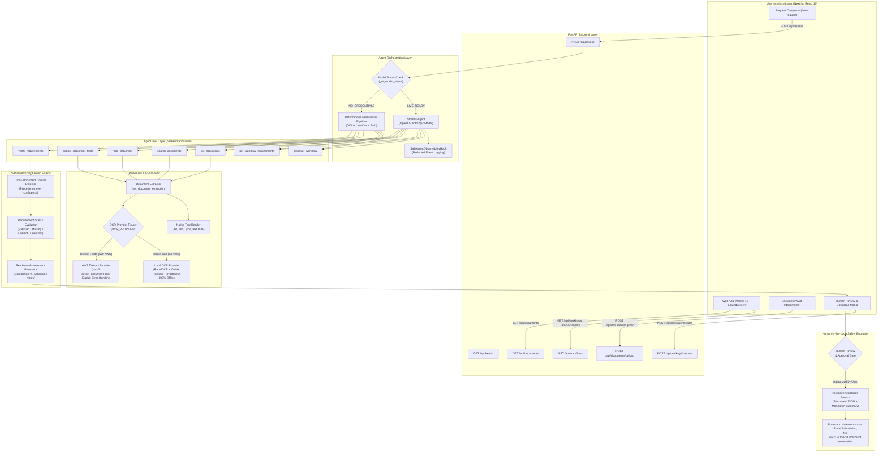

# Paperwork Agent Architecture

## System Overview

Paperwork Agent is an evidence-first administrative assistant designed to verify and guide users through complex bureaucratic and organizational paperwork workflows.

Unlike standard conversational document chatbots or summarizers, Paperwork Agent pairs **LLM-driven goal discovery and tool orchestration** with **deterministic rule verification, strict cross-document conflict detection, and human authorization boundaries**.

---

## Architectural Diagram

---

## Detailed Component Architecture

### 1. Client Layer (Next.js 16 + React 19)
- **Request Composer (`/new-request`)**: Allows users to enter natural language paperwork goals, inspect live discovery results, view requirement checklists, examine evidence provenance pills, and inspect cross-document conflicts.
- **Document Vault (`/documents`)**: Displays locally available files with file type icons, byte counts, and visual extraction badges:
  - `Native text` (gray) for plain text, Markdown, JSON, and machine-readable PDFs.
  - `OCR` (blue) for files extracted locally via RapidOCR.
  - `Textract` (purple) for files processed via AWS Textract.
  - Provides drag-and-drop file upload with real-time feedback.
- **Human Review & Download Modal**: Presents complete readiness assessment summaries with an explicit review checkpoint. The user confirms verified facts and generates an application package bundle.

### 2. Backend API Layer (FastAPI)
The API layer in [`backend/app/api.py`](file:///d:/Projects/Paperwork%20AI/backend/app/api.py) exposes six REST endpoints:
- `GET /api/health`: Immediate health status check; requires zero credentials or network dependencies.
- `GET /api/workflows`: Lists registered paperwork schemas from `backend/data/workflows/`.
- `GET /api/documents`: Reuses `list_documents` tool logic to return available user files.
- `POST /api/assess`: Accepts a user goal string, evaluates credentials, routes to the Strands Agent or deterministic pipeline, and returns a validated `ReadinessAssessment`.
- `POST /api/documents/upload`: Securely uploads documents to the vault. Implements path traversal sanitization, supported file extension whitelisting (`.txt`, `.md`, `.json`, `.pdf`, `.png`, `.jpg`, `.jpeg`), accidental collision protection, and a 10MB size cap.
- `POST /api/package/prepare`: Transforms an existing `ReadinessAssessment` into a signed package bundle with verified facts and a clean Markdown summary. Does not re-invoke the LLM.

### 3. Strands Agents SDK Orchestration
The agent layer in [`backend/app/agent.py`](file:///d:/Projects/Paperwork%20AI/backend/app/agent.py) builds upon the **Strands Agents SDK**:
- **Agent Initialization**: Constructs a Strands `Agent` configured with `SYSTEM_PROMPT`, the 7 registered tools, and a structured output model (`ReadinessAssessment`).
- **Provider Support**: Configured via `MODEL_PROVIDER` (`openai` or `anthropic`) with `MODEL_ID`.
- **Safe Observability**: Attaches a custom `SafeAgentObservabilityHook` subscribing to SDK lifecycle events (`BeforeInvocationEvent`, `AfterInvocationEvent`, `BeforeToolCallEvent`, `AfterToolCallEvent`). Logs timestamps, tool call names, durations, and success/failure statuses while strictly redacting user prompts, document snippets, extracted values, PII, and API keys.
- **Deterministic Pipeline Fallback**: When no LLM API key is configured (`ModelStatus.NO_CREDENTIALS`), the system executes `assess_paperwork_deterministic`. This executes the exact same 7 tools in sequence, providing complete functionality for offline demonstrations, unit tests, and air-gapped environments.

> **Note on Bedrock AgentCore**: Amazon Bedrock AgentCore is not required for the current implementation and is not currently used.

### 4. Registered Agent Tools (`backend/app/tools/`)
The agent interacts with the world exclusively through 7 strongly-typed, schema-validated tools:

| Tool Name | Module | Purpose | Inputs | Primary Outputs / Effects |
| :--- | :--- | :--- | :--- | :--- |
| `discover_workflow` | `requirements.py` | Matches a natural-language goal against registered workflows | `user_goal: str` | Matched `workflow_id`, `confidence`, and matching explanation |
| `get_workflow_requirements` | `requirements.py` | Loads requirements, accepted evidence types, and validation hints | `workflow_id: str` | Structured requirement definitions and field checklists |
| `list_documents` | `documents.py` | Discovers available files in the user's document repository | None | Document IDs, filenames, sizes, extensions, extraction methods |
| `search_documents` | `documents.py` | Performs targeted keyword search over document text | `query: str` | Top-matching document IDs, snippets, and relevance scores |
| `read_document` | `documents.py` | Reads full normalized document content and provenance | `document_id: str` | Complete text, line count, extraction method, confidence |
| `extract_document_facts` | `documents.py` | Extracts requested factual fields with verbatim snippets | `document_id: str`, `requested_fields: str` | List of `DocumentFact` objects with page numbers and confidence |
| `verify_requirements` | `verification.py` | Executes authoritative deterministic verification rules | `workflow_id: str`, `evidence_json: str` | Validated `ReadinessAssessment` with completion %, gaps, and conflicts |

### 5. Document & OCR Pipeline
Document evidence acquisition is unified in `get_document_extraction`:
- **Native Text Files (`.txt`, `.md`, `.json`)**: Directly read with UTF-8 encoding.
- **Text PDFs**: Extracted using `PyPDF2`. If native text extraction returns empty (scanned or image-based PDF), it transparently falls back to the OCR pipeline.
- **Images (`.png`, `.jpg`, `.jpeg`) and Scanned PDFs**: Routed through `app.ocr`:
  - **Local OCR (`LocalOCRProvider`)**: Uses `rapidocr-onnxruntime` for text detection and recognition. Uses `pypdfium2` to render scanned PDF pages to memory buffers. Runs 100% offline with zero outbound network calls.
  - **AWS Textract (`TextractOCRProvider`)**: Optional cloud provider using `boto3.client("textract")`. Calls `detect_document_text`, reconstructs reading lines, and normalizes confidence to `0.0 – 1.0`.
  - **Conflict Safeguard**: High OCR confidence (e.g. 99%) **never** overrides cross-document conflict detection. If two documents present conflicting facts, the conflict remains a first-class issue requiring user attention.

### 6. Authoritative Deterministic Verification
Verification is strictly code-backed and deterministic:
1. **Evidence Grouping**: Matches extracted facts against requirement field definitions.
2. **First-Class Conflict Detection**: Compares values for identical fields across multiple documents. If normalized values differ (e.g., DOB `1995-03-15` in an ID scan vs `1995-03-16` in a graduation certificate), the requirement is flagged as `CONFLICT`.
3. **Requirement Status Calculation**:
   - `SATISFIED`: Required evidence is present, confidence is adequate, and no conflicts exist.
   - `MISSING`: No evidence found; returns actionable guidance on accepted formats and validation hints.
   - `CONFLICT`: Discrepant values found across documents.
   - `UNCERTAIN`: Evidence present but confidence is low or unverified.
4. **Completion Calculation**: Deterministic percentage based on satisfied required items.

### 7. Human-in-the-Loop Safety Boundary
- **Explicit Authorization**: The human user reviews the readiness assessment, missing items, and flagged conflicts.
- **Work Product Generation Only**: Clicking "Approve & Prepare Package" generates a structured submission package (`pkg-*`) and Markdown summary.
- **Strict Boundary**: The system **never** performs consequential external actions. It does not submit forms to external websites, handle payments, solve CAPTCHAs, or enter OTPs.
